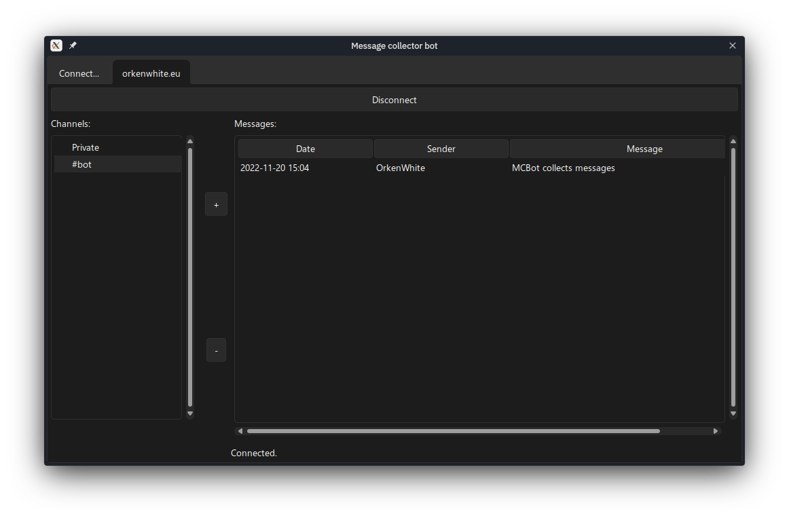

# Üzenetgyűjtő bot

*Szerző: Fábián Patrik*

Egy IRC bot, ami a neki szánt üzeneteket gyűjti. Ebbe az összes privát üzenet, illetve a bot-ot említő (azaz a felhasználónevét külön szóként tartalmazó üzenetek) tartoznak bele.

A bot az *asyncio* modult használja a hálózati kommunikációhoz és az eseménykezeléshez.

A bot egyszerre több szerveren és több szobában képes jelen lenni, valamint képes válaszolni a PING,TIME és VERSION CTCP kérésekre.

**Az SSL-t és/vagy kötelező NickServ-es regisztrációt használó szerverek (még) nem támogatottak!**

## Indítási függőségek
- asyncio
- tkinter
- datetime
- importlib

## Választható függőségek:    
- [sv_ttk](https://github.com/rdbende/Sun-Valley-ttk-theme) a képernyőképen látható kinézethez

## Modulok, osztályok és függvények:
- bot_controller
    - Controller
        - add_message(self,server, channel, user, msg)
        - banned(self, server)
        - cannot_join(self, server, channel)
        - close(self)
        - connect(self, hostname, port, username, fullname)
        - connection_success(self, name)
        - disconnect(self, server, reason)
        - join_channel(self, server, channel)
        - joined_channel(self, server, channel, user)
        - kicked(self, server, user, channel, reason)
        - leave_channel(self, server, channel, reason='Message bot leaving')
        - left_channel(self, server, channel, user)
        - need_registration(self, server)
        - remove_channel(self, server, channel)
        - wrong_nick(self, server)
    - MessageHandler
        - error(self, msg)
        - handle_message(self, source, dest, msg)
        - kicked(self, source, channel, reason)
        - server_message(self, header, msg
- irc_client
   - IRCProtocol(asyncio.protocols.Protocol)
        - connection_lost(self, exc)
        - connection_made(self, transport)
        -  data_received(self, data)
        - handle_commands(self, commands)
        - handle_ctcp(self, source, command, args, doNotReply)
        - handle_kick(self, source, channel, args)
        - handle_message(self, source, destination, msg, doNotReply)
        - join_channel(self, channel)
        - leave_channel(self, channel, reason)
        - num_reply(self, command, args)
        - quit_server(self, reason)
        - send_command(self, cmd)
        - send_message(self, recipient, message)
        - set_invisible(self, isInvisible)
- bot_gui
    - BotWindow
        - add_channel(self, server, channel)
        - channel_selected(self, server)
        - create_server_tab(self, server_name)
        - error_message(self, title, message)
        - init_controls(self)
        - join_channel(self, server)
        - leave_channel(self, server, channel)
        - on_close(self)
        - quit_server(self, server)
        - remove_channel(self, server, channel)
        - remove_server(self, server)
        - start_connect(self)
        - successful_connection(self, host)
        - updateLoop(self)
        - update_messages(self, server, channel)
    - ConnectData
